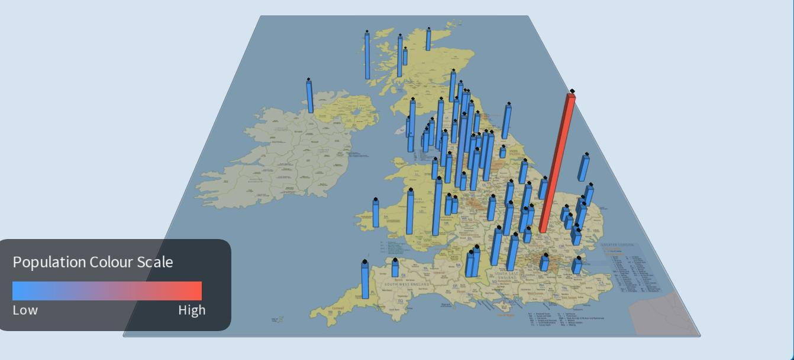
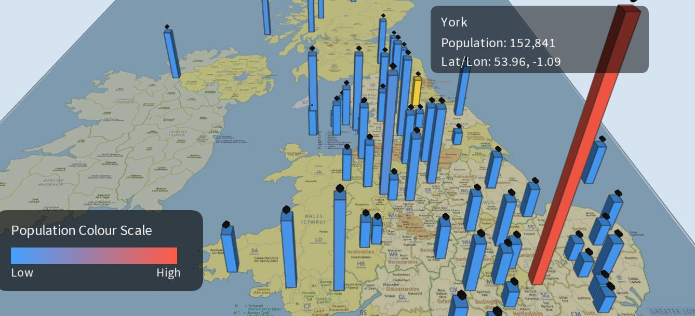

# UK Population 3D Visualisation

An interactive 3D map built with Processing to explore population change across UK cities in 1991, 2001 and 2011.



## What it does

- Places UK cities geographically using latitude and longitude.
- Encodes population as 3D bar height and a blue-to-red colour scale.
- Uses logarithmic height scaling so smaller cities remain visible alongside London.
- Switches between the 1991, 2001 and 2011 datasets.
- Supports mouse-wheel zoom, mouse drag and arrow-key panning.
- Shows city, population and coordinate details on hover.
- Filters cities using an adjustable population threshold.

## Built with

- Processing (Java mode)
- P3D rendering
- CSV data
- Latitude/longitude coordinate mapping

## Run locally

1. Install [Processing](https://processing.org/download).
2. Open `UKPopulation3D/UKPopulation3D.pde` in Processing.
3. Confirm the sketch is in the `UKPopulation3D` folder with its `data` folder intact.
4. Select Java mode and press **Run**.

No third-party Processing libraries are required.

## Controls

| Input | Action |
| --- | --- |
| `1`, `2`, `3` | Show 1991, 2001 or 2011 |
| Mouse wheel | Zoom |
| Mouse drag / arrow keys | Pan |
| Hover over a bar | Show city details |
| `F` | Toggle the population filter |
| `+` / `-` | Adjust the filter by 50,000 |
| `R` / double-click | Reset the view |

## Visualisation design

Population is shown through both bar height and colour. Bar height uses a logarithmic scale to prevent London's much larger population from flattening the visual differences among other cities. The map layout preserves geographic context, while hover details follow an overview-first, details-on-demand approach.



## Repository structure

```text
UKPopulation3D/          Runnable Processing sketch
  UKPopulation3D.pde    Application source
  data/                  CSV dataset and map image
docs/screenshots/        Application screenshots
docs/coursework-report.pdf
```

## Data and asset note

The population CSV and UK map image are retained from the original coursework package. Their original source and reuse licence were not recorded in the supplied files. Verify provenance and licensing before wider redistribution or commercial use.

## Further documentation

The original design rationale and screenshots are available in [the coursework report](docs/coursework-report.pdf).

## Author

[Qasim Ali](https://www.linkedin.com/in/qasim-ali20/)
